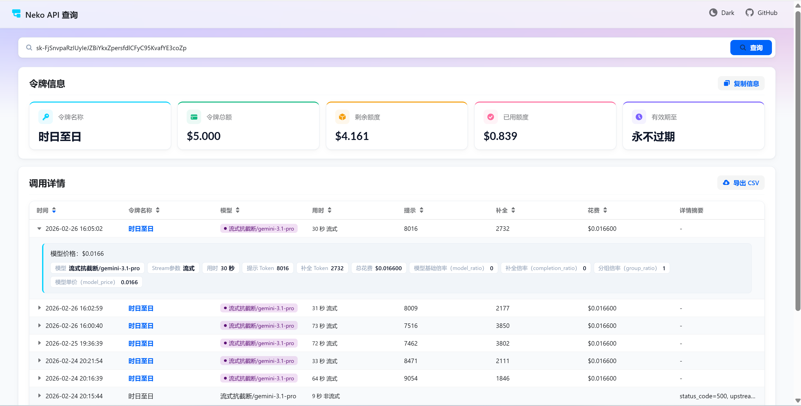

> 该项目需配合NewAPI才能正常使用：[https://github.com/Calcium-Ion/new-api](https://github.com/Calcium-Ion/new-api)

<div align="center">

<h1 align="center">Neko API Key Tool</h1>

NewAPI 令牌查询页

</div>




### 使用方法

#### 环境变量说明

```
SHOW_BALANCE: 是否展示令牌信息，true 或 false
SHOW_DETAIL: 是否展示调用详情，true 或 false
BASE_URL: 你的NewAPI项目地址（支持多站点 JSON 格式）
SHOW_GITHUB_ICON: 是否展示Github图标，true 或 false
```

例如如下配置：
```
# 展示令牌信息
SHOW_BALANCE=true

# 展示调用详情
SHOW_DETAIL=true

# NewAPI的BaseURL（支持多个NewAPI站点聚合查询，键值对中的键为站点名称，值为站点的URL）
BASE_URL={"server1": "https://nekoapi.com", "server2": "https://gf.nekoapi.com"}

# 展示GitHub图标
SHOW_GITHUB_ICON=true
```

> **Vercel 部署注意**：Vercel 仍使用 CRA 构建时注入，环境变量需加 `REACT_APP_` 前缀（如 `REACT_APP_BASE_URL`），程序已做自动兼容。

#### Docker 部署（推荐）

直接使用预构建镜像，无需本地编译：

```bash
# 1. 创建 docker-compose.yml 和 .env 文件
curl -O https://raw.githubusercontent.com/FloatingDream528/neko-api-key-tool/main/docker-compose.yml
curl -O https://raw.githubusercontent.com/FloatingDream528/neko-api-key-tool/main/.env.example
cp .env.example .env

# 2. 修改 .env 中的配置
vim .env

# 3. 启动
docker compose up -d
```

或者克隆仓库后部署：

```bash
git clone https://github.com/FloatingDream528/neko-api-key-tool.git
cd neko-api-key-tool
cp .env.example .env
vim .env
docker compose up -d
```

#### Vercel 部署

1. 准备好你的 [NewAPI项目](https://github.com/Calcium-Ion/new-api)；
2. Fork 本仓库，在 Vercel 中导入项目；
3. 在 Vercel 项目设置中配置环境变量（需使用 `REACT_APP_` 前缀）：
   - `REACT_APP_SHOW_BALANCE=true`
   - `REACT_APP_SHOW_DETAIL=true`
   - `REACT_APP_BASE_URL={"server1": "https://nekoapi.com"}`
   - `REACT_APP_SHOW_ICONGITHUB=true`
4. 部署完毕后，即可开始使用；
5. （可选）[绑定自定义域名](https://vercel.com/docs/concepts/projects/domains/add-a-domain)：Vercel 分配的域名 DNS 在某些区域被污染了，绑定自定义域名即可直连。

### 二次开发
复制.env.example文件为.env，根据自己需求配置env文件中的环境变量。
